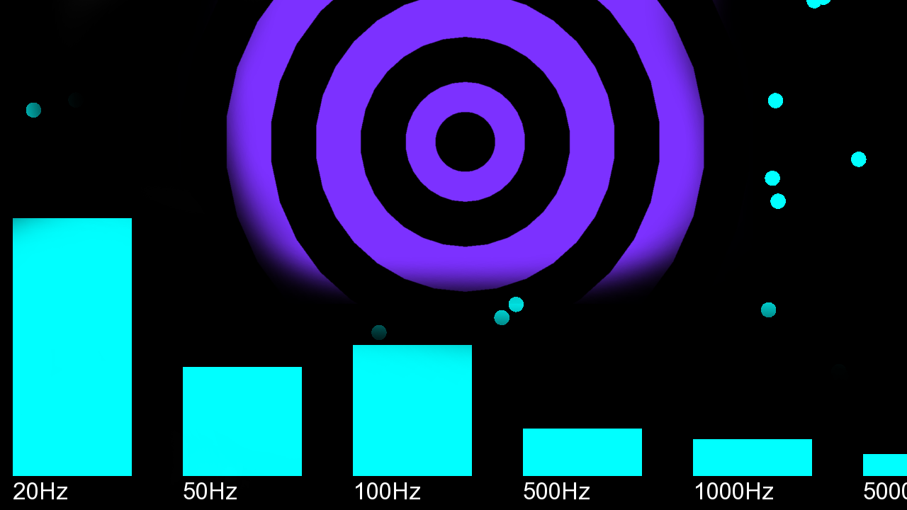

# Visul
Music visualizator  
Records sound via pulseaudio API and creates visualization  
For now it can only show frequency bars or semi-rhythimc strobe cicles  
Probably will be upgraded in the future with feature detection using neural networks or something  

## Building
**[WARNING - do not run if you have epilepsy]**  
To build run `make release` or `make debug`  
To run do `./main`  

#### USED LIBRARIES:

Pulseaudio:  
sudo apt install libpulse-dev

SFML:  
sudo apt install libsfml-dev

FFTW 3.3.8:  
http://www.fftw.org/download.html  
./configure && make && sudo make install  
